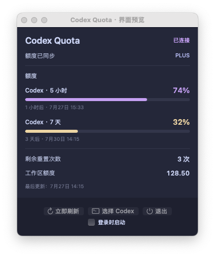

<p align="center">
  
</p>

<p align="center">
  一个轻量、原生、只驻留在菜单栏的 Codex 额度查看器。
</p>

<p align="center">
  <code>macOS 14+</code>&nbsp;&nbsp;·&nbsp;&nbsp;
  <code>Apple Silicon</code>&nbsp;&nbsp;·&nbsp;&nbsp;
  <code>AppKit</code>&nbsp;&nbsp;·&nbsp;&nbsp;
  <code>无第三方依赖</code>
</p>

<p align="center">
  
</p>

<p align="center">
  <sub>真实 AppKit 界面，截图使用模拟额度数据。</sub>
</p>

## 为什么需要 Codex Quota

Codex 的额度状态不应该在切换窗口后消失。Codex Quota 将当前账号最紧张的额度窗口留在 macOS 菜单栏，并在点击后展开全部详情。

- **一眼看到剩余量**：菜单栏始终显示所有额度窗口中的最低剩余百分比。
- **变化及时可见**：监听 App Server 更新事件，并每 30 秒主动校准一次。
- **详情不遗漏**：展示每个额度窗口、相对与绝对重置时间、剩余重置次数，以及可选的工作区余额。
- **原生且克制**：AppKit + Catppuccin Macchiato，不创建主窗口，不显示 Dock 图标。
- **不碰认证凭据**：只通过本机 Codex App Server 通信，不读取 `auth.json`，也不保存令牌。

## 快速开始

### 运行要求

- macOS 14 或更新版本
- Apple Silicon Mac
- ChatGPT App 或 Codex CLI
- Apple Command Line Tools

如果尚未安装命令行工具：

```bash
xcode-select --install
```

### 从源码构建

```bash
git clone https://github.com/msunx/codex-quota.git
cd codex-quota
./scripts/build-app.sh
```

构建结果位于：

```text
dist/Codex Quota.app
```

将 `Codex Quota.app` 拖入 `/Applications` 后打开。应用启动时会依次查找：

1. 上次手动选择的 Codex；
2. ChatGPT / Codex App 内置的 `codex`；
3. Homebrew 常用路径与当前 `PATH`。

找不到时，可在面板中点击“选择 Codex”手动指定。

> [!NOTE]
> 构建只需要 Apple Command Line Tools，不依赖完整 Xcode，也不要求升级到 macOS 26。

## 工作方式

<p align="center">
  
</p>

Codex Quota 启动本机 `codex app-server --stdio` 子进程，完成 JSON-RPC 初始化后读取当前账号与额度：

- `account/read`：确认当前登录状态；
- `account/rateLimits/read`：读取全部额度窗口；
- `account/rateLimits/updated`：额度变化时实时更新；
- 30 秒轮询：在通知缺失时兜底校准；
- 打开面板、网络恢复或系统唤醒：立即刷新。

连接中显示 `…`，断开或离线时显示 `—`。超过两分钟没有成功更新时，详情面板会将数据标记为陈旧。

## 界面与状态

| 状态 | 表现 |
| --- | --- |
| 正常额度 | 使用 `#C59FF7` 显示剩余百分比与进度 |
| 额度偏低 | 使用黄色提示 |
| 额度紧张 | 使用红色提示 |
| 未登录 | 可发起官方 ChatGPT 浏览器登录 |
| App Server 中断 | 按 2、5、15、30、60 秒退避重连 |
| 工作区未返回 credits | 不显示工作区额度区域 |

应用尊重 macOS“减少动态效果”设置，并为核心状态和控件提供文字及 VoiceOver 信息。

## 隐私边界

Codex Quota 的数据路径只发生在本机：

- 不读取 `~/.codex/auth.json`；
- 不持久化登录 URL 或认证令牌；
- 不直接请求 ChatGPT 私有接口；
- 不记录完整额度响应；
- 只跟随当前 Codex / ChatGPT 活动账号和工作区。

## 当前限制

- 仅构建 arm64 版本；
- 当前版本为 `0.1.0`；
- 不支持多账号切换；
- 不包含自动更新、Mac App Store 分发或内置 Codex；
- 本地构建使用 ad-hoc 签名且未公证，适合个人本机使用。

## 常见问题

<details>
<summary><strong>为什么无法开启“登录时启动”？</strong></summary>

请先将 `Codex Quota.app` 移入 `/Applications`，重新打开后再启用。

</details>

<details>
<summary><strong>出现 ~/.codex 权限相关错误怎么办？</strong></summary>

确认当前用户拥有 `~/.codex` 的读写权限，并检查是否有其他工具将目录设为只读。

</details>

<details>
<summary><strong>当前 Codex 版本不支持额度接口怎么办？</strong></summary>

更新 ChatGPT App 或 Codex CLI，然后点击“立即刷新”。

</details>

<details>
<summary><strong>全屏时为什么看不到额度？</strong></summary>

macOS 全屏模式可能自动隐藏整条菜单栏。将鼠标移到屏幕顶部，或在系统设置中关闭菜单栏自动隐藏。

</details>

## 开发

```text
Sources/CodexQuota/   AppKit 界面、额度模型、App Server 客户端
Resources/            App Bundle 配置
scripts/              构建与图标生成脚本
```

产品边界见 [PRODUCT.md](./PRODUCT.md)，视觉和交互约束见 [DESIGN.md](./DESIGN.md)。

欢迎通过 Issue 报告问题或提出改进建议。
