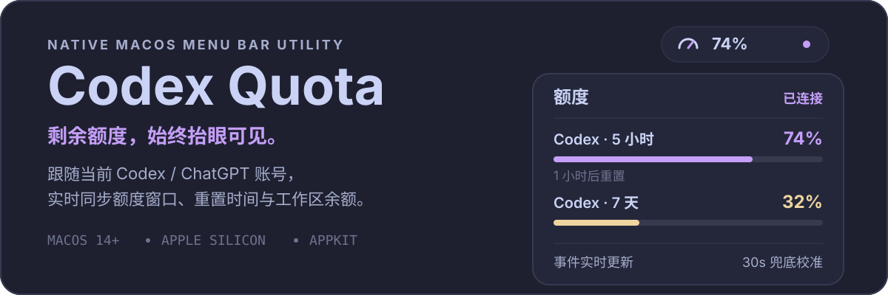
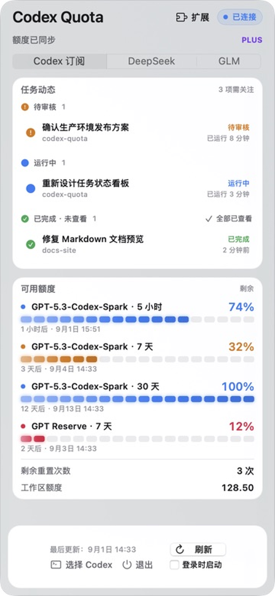
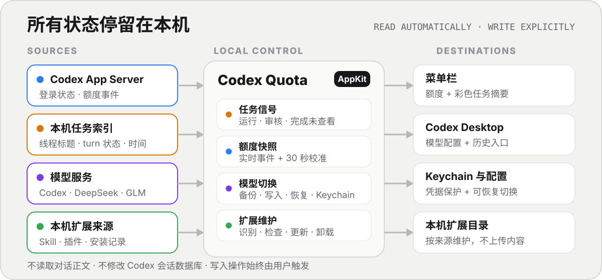

<p align="center">
  
</p>

<p align="center">
  原生、轻量、本地优先的 macOS 菜单栏控制面。
</p>

<p align="center">
  <code>macOS 14+</code>
  <code>Apple Silicon</code>
  <code>AppKit</code>
  <code>Local-first</code>
</p>

<p align="center">
  <a href="#开始使用"><strong>开始使用</strong></a> ·
  <a href="#任务与菜单栏信号"><strong>任务信号</strong></a> ·
  <a href="#模型来源"><strong>模型来源</strong></a> ·
  <a href="#扩展管理"><strong>扩展管理</strong></a> ·
  <a href="#数据与隐私"><strong>数据与隐私</strong></a>
</p>

## 一个入口，四类日常状态

<p align="center">
  
</p>

<p align="center">
  <sub>当前 main 分支的 AppKit 预览 · 任务与额度均为模拟数据</sub>
</p>

Codex Quota 把经常散落在 Codex、终端和配置目录里的状态集中到一个 360pt 菜单栏面板：

- **盯任务**：菜单栏显示最高优先级任务摘要，主看板只保留待审核、运行中和完成但尚未查看的任务；任务完成或需要审批时发送 macOS 系统通知。
- **看额度**：同时展示全部 Codex 额度窗口、重置时间、剩余重置次数和可选的工作区额度。
- **切模型**：在 Codex 订阅、DeepSeek 与智谱 GLM 之间切换，同时保留原有配置的恢复路径。
- **管扩展**：识别第三方与自建 Skill / 插件，检查版本、更新、定位目录并完整卸载 Skill。

## 开始使用

### 下载稳定版

从 [GitHub Releases](https://github.com/msunx/codex-quota/releases/latest) 下载 `Codex-Quota-v0.2.8-macos-arm64.zip`，解压后将 **Codex Quota.app** 拖入 `/Applications`。

> [!NOTE]
> 最新稳定版为 `v0.2.8`，包含任务动态看板、GLM 来源与新版暖灰界面。

应用使用 ad-hoc 签名且未公证。首次打开如被 macOS 拦截，请前往“系统设置 → 隐私与安全性”确认打开。

### 从源码构建

准备 macOS 14 或更新版本、Apple Silicon Mac，以及 Apple Command Line Tools：

```bash
xcode-select --install
git clone https://github.com/msunx/codex-quota.git
cd codex-quota
./scripts/build-app.sh
```

构建结果位于 `dist/Codex Quota.app`。整个过程只使用 Apple Clang，不依赖完整 Xcode。

应用会依次查找上次手动选择的 Codex、Codex App 内置 CLI、Homebrew 常见路径和当前 `PATH`；仍未找到时，可在面板底部手动选择可执行文件。

## 任务与菜单栏信号

应用每秒只读校准本机 Codex turn 状态。菜单栏始终只显示优先级最高的一组摘要，避免多个任务同时占满菜单栏：

| 信号 | 含义 | 行为 |
| --- | --- | --- |
| 🟠 `!` | 待审核 | 仅在获得明确审核等待信号时显示 |
| 🟢 `✓` | 已完成、未查看 | Codex 切到前台后自动清除全部完成提醒 |
| 🔵 `●` | 运行中 | 显示本机最新任务标题、项目和运行时间 |

优先级固定为“待审核 → 未查看完成 → 运行中”。Codex 已在前台时完成的任务会直接视为已查看；手动点击任务或“全部已查看”仍可作为兜底。

首次启动新版本时，macOS 会询问是否允许 Codex Quota 发送通知。任务首次进入“待审核”或“已完成”时会显示系统通知和提示音；点击通知可唤起 Codex。相同事件会自动去重，通知展示方式可随时在“系统设置 → 通知 → Codex Quota”中调整。

> [!IMPORTANT]
> 独立菜单栏应用无法读取 Codex Desktop 私有进程中的全部运行时信息。无法确认任务是否正在等待审核时，会保守显示为“运行中”，不会根据持续时间猜测。

## 模型来源

| 来源 | 凭据 | 可见状态 | 可选模型 |
| --- | --- | --- | --- |
| Codex 订阅 | 复用本机现有登录 | 额度窗口、重置时间、任务状态 | 当前 Codex 配置 |
| DeepSeek | DeepSeek API Key | 官方余额 | `deepseek-v4-flash`、`deepseek-v4-pro` |
| 智谱 GLM | 智谱 API Key | 配置状态 | `glm-5.3-flash`、`glm-5.3` |

切换外部来源时，应用会先备份 `~/.codex/config.toml` 和已有的 `models.json`，再写入新配置；切回 Codex 订阅时恢复备份。API Key 按 Codex 接入要求写入配置，并使用独立服务项额外保存在 macOS 钥匙串中。

第一次切换外部来源：

1. 在面板顶部选择 **DeepSeek** 或 **GLM**；
2. 输入或使用 `⌘V` 粘贴对应 API Key；
3. 选择模型；
4. 配置成功后选择 **立即重启**。

DeepSeek 模式需要 Codex `0.144.0` 或更新版本。GLM 使用智谱提供的 OpenAI Responses 端点 `https://open.bigmodel.cn/api/v1`。

> [!NOTE]
> 本机历史兼容桥只注入由 Codex Quota 发起的新 Codex 进程。若完全退出后从 Dock 手动打开 Codex，可能绕过兼容桥；重新切换一次来源并选择“立即重启”即可恢复统一入口，不会删除对话。

## 扩展管理

扩展页只展示第三方与自建扩展，过滤系统内置项和插件随附的重复 Skill。每个条目保留来源、作用域、用途与版本状态。

| 来源 | 版本依据 | 可执行操作 |
| --- | --- | --- |
| GitHub Skill | 安装记录中的上游地址与 Git tree 哈希 | 检查、更新、打开目录、卸载 |
| Well-known Skill | 上游 `SKILL.md` 校验结果 | 检查、更新、打开目录、卸载 |
| 自建 / 无来源 Skill | 标记为“本地维护”，不猜测版本 | 打开目录、卸载 |
| Codex 插件 | App Server 返回的本地与市场版本 | 检查、更新 |
| CLI Skill 套件 | 对应 CLI 的官方更新机制 | 整组检查、更新、定位、卸载 |

应用每 6 小时在后台检查一次，也可以手动触发。只有确认存在新版本的条目才会启用“更新”。卸载 Skill 前会明确提示范围；执行后同步清理已发现的安装目录和对应安装记录，失败时保留具体原因。

## 它如何工作

<p align="center">
  
</p>

- **额度状态**：App Server 事件为主、30 秒轮询为辅；打开面板、网络恢复或系统唤醒时立即刷新。
- **任务状态**：只读查询本机会话索引与 turn 状态数据库，每秒校准；已查看记录只保存在应用偏好中。
- **系统通知**：任务完成或获得明确的审批等待信号时，通过 macOS 通知中心发送本地通知，不经过外部服务。
- **模型配置**：只在用户主动切换时备份、写入或恢复配置，并询问是否重启 Codex。
- **历史兼容桥**：仅为 `thread/list` 补充本机 provider 过滤，不读取或改写会话内容。
- **扩展维护**：只读扫描来源与版本；更新、打开目录和卸载都由用户明确触发。

## 数据与隐私

> [!TIP]
> Codex Quota 不需要单独保存 Codex 登录令牌，也不会读取或上传对话正文。

- 不读取 `~/.codex/auth.json`，不保存登录 URL、认证令牌或完整服务响应。
- 任务动态只读取线程标题、工作目录、turn 标识、状态和时间，不修改 Codex SQLite 数据库。
- DeepSeek 余额只请求官方 `/user/balance`；DeepSeek 与 GLM API Key 不写日志、不在界面回显。
- 历史兼容桥不修改 SQLite 会话库或 JSONL 内容。
- 扩展检查只按安装来源访问对应上游，不上传本机 Skill 内容。
- 配置切换、扩展更新、Skill 卸载和登录时启动都需要用户主动操作。

## 兼容性与限制

- macOS 14+，当前只构建 arm64 版本；
- 需要 Codex App 或 Codex CLI；
- 当前稳定版为 `0.2.8`，不支持多账号切换；
- 不包含应用自身自动更新、Mac App Store 分发、公证或内置 Codex；
- 无来源元数据的本地 Skill 无法自动判断新版本；
- 登录时启动默认关闭。

## 常见问题

<details>
<summary><strong>切换到 DeepSeek 或 GLM 后为什么只看到当前来源的对话？</strong></summary>

确认切换完成时选择了“立即重启”。兼容桥只会注入由 Codex Quota 发起的新 Codex 进程。

</details>

<details>
<summary><strong>“统一历史”会修改或合并旧对话吗？</strong></summary>

不会。统一的只是列表入口；每条对话仍保留原始 provider 和内容。

</details>

<details>
<summary><strong>为什么无法开启“登录时启动”？</strong></summary>

请先将 `Codex Quota.app` 移入 `/Applications`，重新打开后再启用。

</details>

<details>
<summary><strong>全屏时为什么看不到菜单栏状态？</strong></summary>

macOS 全屏模式可能隐藏整条菜单栏。将鼠标移到屏幕顶部，或在系统设置中关闭菜单栏自动隐藏。

</details>

## 开发

```text
Sources/CodexQuota/    AppKit 界面、额度、任务状态、配置与扩展管理
Sources/HistoryBridge/ 本机历史列表兼容桥
Resources/             App Bundle 配置
scripts/               构建与图标生成脚本
```

产品边界见 [PRODUCT.md](./PRODUCT.md)，视觉与交互约束见 [DESIGN.md](./DESIGN.md)。欢迎通过 [Issue](https://github.com/msunx/codex-quota/issues) 报告问题或提出建议。
