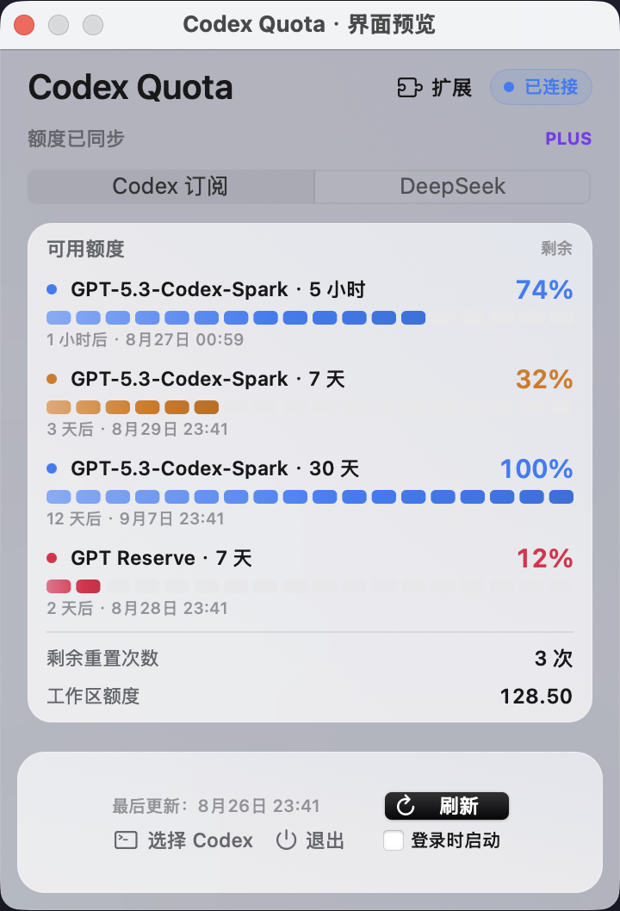
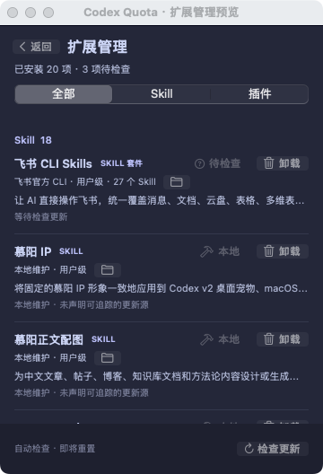

<p align="center">
  
</p>

<p align="center">
  一个原生、轻量、本地优先的 macOS 菜单栏工具。
</p>

<p align="center">
  <code>v0.2.7</code>
  <code>macOS 14+</code>
  <code>Apple Silicon</code>
  <code>AppKit</code>
</p>

<p align="center">
  <a href="#开始使用"><strong>开始使用</strong></a> ·
  <a href="#模型来源"><strong>模型来源</strong></a> ·
  <a href="#扩展管理"><strong>扩展管理</strong></a> ·
  <a href="#数据与隐私"><strong>数据与隐私</strong></a>
</p>

## 先看实际界面

<p align="center">
  
  &nbsp;&nbsp;
  
</p>

<p align="center">
  <sub>当前 main 分支的 AppKit 预览 · 额度为模拟数据 · 扩展列表来自本机只读扫描</sub>
</p>

Codex Quota 把分散在命令行、配置文件和扩展目录里的高频操作，收进一个不占 Dock 位置的 360pt 菜单栏面板：

- **看额度**：同时展示 Codex 的全部额度窗口、重置时间、剩余重置次数和可选的工作区余额。
- **切来源**：在 Codex 订阅、DeepSeek 与智谱 GLM 之间切换；GLM 支持 `glm-5.3-flash` 和 `glm-5.3`。
- **保留历史入口**：由 Codex Quota 重启 Codex 后，可在本机列表中同时看到 `openai`、`deepseek`、`zhipu` 和旧版 `custom` provider 的对话入口。
- **管扩展**：识别第三方与自建 Skill / 插件，检查版本、执行更新、定位目录，并完整卸载 Skill。

## 开始使用

### 下载稳定版

从 [GitHub Releases](https://github.com/msunx/codex-quota/releases/latest) 下载 `Codex-Quota-v0.2.7-macos-arm64.zip`，解压后将 **Codex Quota.app** 拖入 `/Applications`。

> [!NOTE]
> Release 同时提供 SHA-256 校验文件；页面截图对应 `v0.2.7` 的暖灰玻璃界面。

应用使用 ad-hoc 签名且未公证。首次打开如被 macOS 拦截，请前往“系统设置 → 隐私与安全性”确认打开。

### 从源码构建

需要 macOS 14 或更新版本、Apple Silicon Mac，以及 Apple Command Line Tools：

```bash
xcode-select --install
git clone https://github.com/msunx/codex-quota.git
cd codex-quota
./scripts/build-app.sh
```

构建结果位于 `dist/Codex Quota.app`。整个过程只使用 Apple Clang，不依赖完整 Xcode，也不要求升级到 macOS 26。

应用会依次查找：

1. 上次手动选择的 Codex；
2. ChatGPT / Codex App 内置的 `codex`；
3. Homebrew 常见路径；
4. 当前 `PATH`。

仍未找到时，可以在面板底部手动选择可执行文件。

## 模型来源

### Codex 订阅

无需额外填写凭据。应用通过本机 `codex app-server --stdio` 复用现有登录状态，读取账号与额度窗口；额度事件实时更新，并每 30 秒校准一次。

### DeepSeek

DeepSeek 模式需要 Codex `0.144.0` 或更新版本。第一次切换时：

1. 选择面板顶部的 **DeepSeek**；
2. 输入或使用 `⌘V` 粘贴 API Key；
3. 选择 `deepseek-v4-flash` 或 `deepseek-v4-pro`；
4. 配置成功后选择 **立即重启**。

切换前，应用会备份 `~/.codex/config.toml` 和已有的 `models.json`；切回 Codex 订阅时恢复原配置。
API Key 按 Codex 接入要求写入配置，并额外保存在 macOS 钥匙串中。

### 智谱 GLM

GLM 模式通过智谱为 Codex 提供的 OpenAI Responses 端点接入。第一次切换时：

1. 选择面板顶部的 **GLM**；
2. 输入或使用 `⌘V` 粘贴智谱 API Key；
3. 选择 `glm-5.3-flash` 或 `glm-5.3`；
4. 配置成功后选择 **立即重启**。

GLM API Key 使用独立的 macOS 钥匙串项保存。模型配置采用 `https://open.bigmodel.cn/api/v1`、Responses 协议和 1M 上下文；切回 Codex 订阅时同样恢复切换前的原始配置。

> [!IMPORTANT]
> 本机历史兼容桥只注入由 Codex Quota 发起的新 Codex 进程。若完全退出后从 Dock 手动打开 Codex，可能绕过兼容桥；
> 重新切换一次来源并选择“立即重启”即可恢复统一入口，不会删除对话。

## 扩展管理

扩展页只展示第三方和自建扩展，过滤 `system` scope、Codex 内置市场以及插件随附的重复 Skill。
每个条目都保留来源、作用域、用途与状态；长说明单行截断，悬停时显示全文。

| 来源 | 版本依据 | 可执行操作 |
| --- | --- | --- |
| GitHub Skill | 安装锁中的上游地址与 Git tree 哈希 | 检查、更新、打开目录、卸载 |
| Well-known Skill | 上游 `SKILL.md` 校验结果 | 检查、更新、打开目录、卸载 |
| 自建 / 无来源 Skill | 标记为“本地维护”，不猜测版本 | 打开目录、卸载 |
| 飞书官方 Skills | 将全部 `lark-*` 聚合为“飞书 CLI Skills” | 整组检查、更新、定位、卸载 |
| Codex 插件 | App Server 返回的本地与市场版本 | 检查、更新 |

应用每 6 小时在后台检查一次，也可以手动触发。只有确认存在新版本的条目才会启用“更新”：

- 独立 Skill 通过 `npx skills` 更新；
- Codex 插件通过 App Server 更新；
- 飞书套件通过 `lark-cli update` 整组更新。

卸载只对 Skill 开放。应用会删除全部已发现的安装目录，并同步清理 `~/.agents/.skill-lock.json` 中对应记录；
执行前会明确提示范围，失败时保留具体原因。飞书套件卸载会移除整组 Skills，但不会删除 `lark-cli`。

> [!NOTE]
> 扩展管理依赖 Codex App Server 的 `skills/list`、`plugin/list` 和 `plugin/install`。旧版 Codex 不支持插件接口时，Skill 仍会正常显示，插件错误会单独呈现。

## 它如何工作

<p align="center">
  
</p>

- **额度状态**：App Server 事件为主、30 秒轮询为辅；瞬时失败按 2、5、15、30、60 秒退避，打开面板、网络恢复或系统唤醒时立即刷新。
- **模型配置**：只在用户主动切换时备份、写入或恢复配置，并询问是否重启 Codex。
- **历史兼容桥**：仅在 `thread/list` 没有显式 provider 条件时补充本机 provider 过滤，不读取或改写会话内容。
- **扩展维护**：只读扫描来源与版本；更新、打开目录和卸载都由用户明确触发。

## 数据与隐私

- Codex 模式只与本机 App Server 通信，不读取 `~/.codex/auth.json`，不保存登录 URL 或认证令牌。
- DeepSeek 余额只请求官方 `/user/balance`；DeepSeek 与 GLM API Key 均不写日志、不在界面回显。
- 历史兼容桥不读取对话正文，不修改 SQLite 会话库或 JSONL 内容。
- 扩展检查只按安装来源访问 GitHub、Well-known Skill 站点、npm、飞书 CLI 或 Codex 插件市场。
- 配置切换、扩展更新与 Skill 卸载都需要用户主动操作。

## 兼容性与限制

- macOS 14+，仅构建 arm64 版本；
- 需要 ChatGPT App 或 Codex CLI；
- 当前版本为 `0.2.7`，不支持多账号切换；
- 不包含应用自身自动更新、Mac App Store 分发、公证或内置 Codex；
- 无来源元数据的本地 Skill 无法自动判断新版本；
- 登录时启动由用户主动开启，默认关闭。

## 常见问题

<details>
<summary><strong>切换到 DeepSeek 或 GLM 后为什么只看到当前来源的对话？</strong></summary>

确认切换完成时选择了“立即重启”。兼容桥只会注入由 Codex Quota 发起的新 Codex 进程。

</details>

<details>
<summary><strong>“统一历史”会修改或合并旧对话吗？</strong></summary>

不会。统一的只是列表入口；每条对话仍保留原始 provider 和内容。

</details>

<details>
<summary><strong>为什么无法开启“登录时启动”？</strong></summary>

请先将 `Codex Quota.app` 移入 `/Applications`，重新打开后再启用。

</details>

<details>
<summary><strong>全屏时为什么看不到额度？</strong></summary>

macOS 全屏模式可能隐藏整条菜单栏。将鼠标移到屏幕顶部，或在系统设置中关闭菜单栏自动隐藏。

</details>

## 开发

```text
Sources/CodexQuota/    AppKit 界面、额度、配置与扩展管理
Sources/HistoryBridge/ 本机历史列表兼容桥
Resources/             App Bundle 配置
scripts/               构建与图标生成脚本
```

产品边界见 [PRODUCT.md](./PRODUCT.md)，视觉与交互约束见 [DESIGN.md](./DESIGN.md)。欢迎通过 [Issue](https://github.com/msunx/codex-quota/issues) 报告问题或提出建议。
